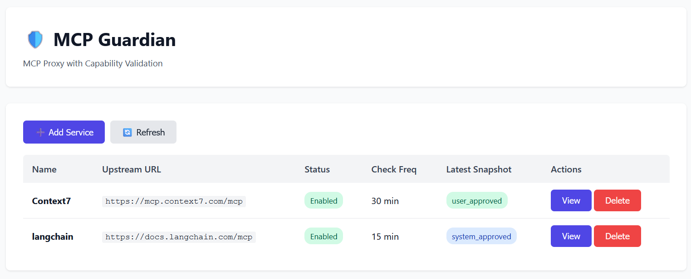
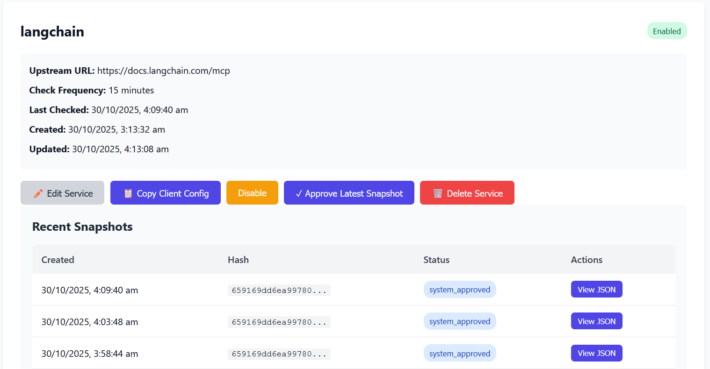

# MCP Guardian 🛡️

A **FastAPI-based MCP proxy** that lets you register multiple upstream MCP servers, expose each under a stable URL, periodically re-validate their capabilities, and **auto-disable** any server whose tools/prompts/resources/spec change until a human re-approves.

## Features

- ✅ **Proxy multiple MCP servers** under stable paths (`/{SERVICE_NAME}/mcp`)
- ✅ **Snapshot capabilities** on onboarding (tools, resources, prompts)
- ✅ **Periodic validation** with configurable check frequency
- ✅ **Auto-disable on changes** - services are automatically disabled if capabilities drift
- ✅ **Admin UI** for service management and diff viewing
- ✅ **RFC 8785 JCS** canonical JSON hashing for robust change detection
- ✅ **SSE streaming support** for real-time MCP interactions
- ✅ **SQLite storage** with JSON1 support

## Architecture

MCP Guardian sits between MCP clients and upstream MCP servers:

```
MCP Clients → MCP Guardian → Upstream MCP Servers
               (proxy + validator)
```

### Key Components

- **Proxy Layer**: Wildcard routing that forwards POST/GET/DELETE to upstream servers
- **Snapshotter**: Captures capabilities (tools/resources/prompts) via MCP protocol
- **Canonicalizer**: RFC 8785 JCS + SHA-256 hashing for deterministic fingerprints
- **Schedulers**: Background tasks for route polling and periodic checks
- **Admin UI**: Web interface for service management

## Quick Start

### Using Docker

```bash
# Build the image
docker build -t mcp-guardian .

# Run the container
docker run -p 8000:8000 \
  -e ADMIN_TOKEN=your-secure-token \
  -v $(pwd)/data:/app/data \
  mcp-guardian
```

### Using Python

```bash
# Install dependencies
pip install -e .

# Set admin token
export ADMIN_TOKEN=your-secure-token

# Run the server
python -m uvicorn mcp_guardian.app.main:app --host 0.0.0.0 --port 8000
```

## Configuration

MCP Guardian uses a `config.yml` file for all configuration. This file is **optional** - if not provided, sensible defaults will be used.

### Quick Start

1. **Copy the example config** (optional):
   ```bash
   cp config.yml.example config.yml
   ```

2. **Edit config.yml** to customize:
   - Admin password (random password generated if not set)
   - Database location
   - Polling intervals
   - Pre-configured MCP services

### Configuration File (`config.yml`)

```yaml
# Admin interface configuration
admin:
  password: "your-secure-password"  # Optional - random if not set
  disable_ui: false                  # Set true to disable admin UI/API

# Polling and scheduling
polling:
  interval_seconds: 60               # Scheduler wake-up frequency
  min_check_frequency: 5             # Minimum check frequency (minutes)

# Database
database:
  url: "sqlite+aiosqlite:///./mcp_guardian.db"

# Pre-configured services (optional)
services:
  - name: "my-service"
    upstream_url: "http://localhost:3000/mcp"
    enabled: true
    check_frequency_minutes: 15
```

### Security Notes

- **Admin Password**: If no password is set in `config.yml`, a random password is generated at startup and logged to the console. **Save this password!**
- **HTTP Basic Auth**: The admin interface uses HTTP Basic Authentication. Username can be anything; password must match the configured/generated password.
- **Disable Admin UI**: For production deployments managed entirely via `config.yml`, set `admin.disable_ui: true` to completely disable the admin interface.

### Deployment Scenarios

**Local Development**:
```bash
# No config file needed - defaults work fine
python -m uvicorn mcp_guardian.app.main:app --reload
# Watch logs for generated admin password
```

**Production (Docker with mounted config)**:
```bash
docker run -d \
  -p 8000:8000 \
  -v /path/to/config.yml:/app/config.yml:ro \
  -v /path/to/data:/app/data \
  mcp-guardian:latest
```

**GitOps Friendly**:
- Store `config.yml` in version control
- Services defined in config are auto-upserted to database on startup
- Existing services (by name) are never overwritten
- Perfect for CI/CD pipelines and infrastructure-as-code

## Usage

### Admin UI

Navigate to `http://localhost:8000/ADMIN/` to access the admin interface.

**Authentication**: You'll be prompted for HTTP Basic Auth credentials. Username can be anything; password must match the value in `config.yml` (or the generated password from logs).

#### Overview

The admin interface provides a dashboard to manage all your MCP services:



*Service list showing enabled services with their upstream URLs, check frequencies, and snapshot approval status*

#### Adding a Service

1. Click **"Add Service"**
2. Fill in:
   - **Service Name**: Alphanumeric identifier (e.g., `my-mcp-service`)
   - **Upstream MCP URL**: Full URL to upstream MCP endpoint (e.g., `http://localhost:3000/mcp`)
   - **Check Frequency**: Minutes between checks (0 = never, minimum 5)
   - **Enable**: Whether to enable the service immediately
3. Click **"Save"**

The system will:
- Initialize the upstream server
- List all tools, resources, and prompts
- Create a canonical JSON snapshot
- Mark it as `user_approved`
- Expose the service at `/{SERVICE_NAME}/mcp`

#### Viewing Service Details

Click **"View"** on any service to see:
- Service configuration
- Recent snapshots
- Diff between approved and latest snapshots
- Actions: Approve, Enable/Disable, Delete



*Service detail view showing configuration, snapshot history, and approval status*

#### Handling Changes

When the periodic checker detects capability changes:
1. Service is **automatically disabled**
2. New snapshot is marked as `unapproved`
3. Admin reviews the diff in the UI
4. Admin clicks **"Approve Latest Snapshot"** to re-enable

### API Endpoints

#### Admin API (requires HTTP Basic Auth)

```
POST   /api/admin/services              # Create service
GET    /api/admin/services              # List all services
GET    /api/admin/services/{name}       # Get service details
PATCH  /api/admin/services/{name}       # Update service
DELETE /api/admin/services/{name}       # Delete service

GET    /api/admin/services/{name}/snapshots  # List snapshots
GET    /api/admin/services/{name}/diff       # Get diff
POST   /api/admin/services/{name}/approve    # Approve latest snapshot
```

#### MCP Proxy (no auth - forwarded to upstream)

```
POST   /{service_name}/mcp    # JSON-RPC requests
GET    /{service_name}/mcp    # SSE streaming
DELETE /{service_name}/mcp    # Session termination
```

**Example MCP client request:**

```bash
curl -X POST http://localhost:8000/my-service/mcp \
  -H "Content-Type: application/json" \
  -H "MCP-Protocol-Version: 2024-11-05" \
  -d '{
    "jsonrpc": "2.0",
    "id": 1,
    "method": "tools/list"
  }'
```

## How It Works

### Initialization Flow

1. Admin creates a service via UI/API
2. Guardian sends `initialize` to upstream
3. Guardian calls `tools/list`, `resources/list`, `prompts/list`
4. Capabilities are sorted, canonicalized (RFC 8785), and hashed (SHA-256)
5. Snapshot stored with `user_approved` status
6. Service enabled and added to route registry

### Periodic Check Flow

Every minute (configurable):

1. Scheduler identifies services due for checks (based on `check_frequency_minutes`)
2. For each due service:
   - Take new snapshot
   - Compare hash with last approved hash
   - If **same**: Create snapshot with `system_approved` status
   - If **different**: Create snapshot with `unapproved` status and **disable service**
3. Route registry reloaded to reflect changes

### Proxy Flow

1. Client sends request to `/{service_name}/mcp`
2. Guardian checks route registry for enabled status
3. If disabled: Return `503 Service Unavailable`
4. If enabled: Forward request to upstream, preserving:
   - Headers: `MCP-Protocol-Version`, `Mcp-Session-Id`, `Last-Event-ID`
   - Body: Raw JSON-RPC
   - SSE: Event stream with proper `id:` propagation
5. Stream response back to client

## Protocol Compliance

MCP Guardian implements **Streamable HTTP** transport from the MCP specification:

- **JSON-RPC 2.0**: All requests/responses follow spec
- **SSE Support**: Server-sent events with resume semantics
- **Session Handling**: Session IDs passed through (no virtualization)
- **Method Support**: `initialize`, `tools/*`, `resources/*`, `prompts/*`

## Development

### Project Structure

```
mcp_guardian/
  app/
    main.py              # FastAPI app + lifespan
    config.py            # Settings
    db.py                # Database setup
    models.py            # SQLAlchemy models
    schemas.py           # Pydantic schemas
    routers/
      admin_api.py       # Admin API endpoints
      admin_ui.py        # Admin UI routes
      proxy.py           # MCP proxy endpoint
    services/
      canonicalize.py    # RFC 8785 JCS + hashing
      proxy_client.py    # HTTP client for upstream
      snapshotter.py     # Capability snapshot logic
      route_registry.py  # In-memory allow-list
      diff.py            # JSON diff utilities
    scheduler/
      route_poller.py    # Reload routes from DB
      check_scheduler.py # Periodic capability checks
    static/admin/        # CSS/JS
    templates/admin/     # HTML templates
```

### Running Tests

```bash
# TODO: Add pytest tests
pytest
```

## Security Considerations (POC)

This is a **Proof of Concept** with basic security:

- ✅ Single shared admin token (env var)
- ✅ Token-based API authentication
- ❌ No HTTPS (use reverse proxy)
- ❌ No rate limiting
- ❌ No audit trail export
- ❌ No multi-tenant RBAC

**For production:**
- Deploy behind reverse proxy (Nginx/Caddy) with TLS
- Implement proper authentication (OAuth2, JWT)
- Add rate limiting
- Enable audit logging
- Restrict CORS origins

## Troubleshooting

### Service won't enable

- Check that upstream MCP server is reachable
- Verify upstream implements required methods: `initialize`, `tools/list`, `resources/list`, `prompts/list`
- Check logs for snapshot errors: `docker logs <container>`

### Changes not detected

- Ensure `check_frequency_minutes` > 0
- Verify scheduler is running (check logs)
- Compare hashes in snapshots table

### SSE not working

- Ensure `Accept: text/event-stream` header is sent
- Check that upstream supports SSE
- Verify no proxy/firewall is buffering responses

## References

- [Model Context Protocol Specification](https://modelcontextprotocol.io/specification/2025-06-18/basic/transports)
- [RFC 8785: JSON Canonicalization Scheme (JCS)](https://www.rfc-editor.org/rfc/rfc8785)
- [FastAPI Lifespan Events](https://fastapi.tiangolo.com/advanced/events/)
- [JSON-RPC 2.0 Specification](https://www.jsonrpc.org/specification)

## License

See [LICENSE.md](LICENSE.md)

## Contributing

This is a POC implementation. Contributions welcome for:
- [ ] Comprehensive test suite
- [ ] Prometheus metrics integration
- [ ] PostgreSQL support
- [ ] Horizontal scaling (Redis for session state)
- [ ] Enhanced authentication/authorization
- [ ] WebSocket transport support

---

**Built with** FastAPI, SQLAlchemy, httpx, sse-starlette, and RFC 8785 JCS 🚀
